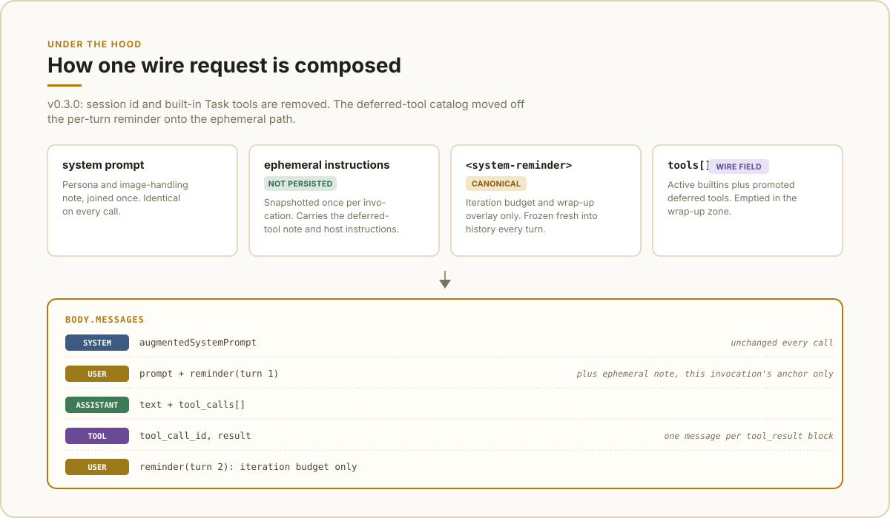
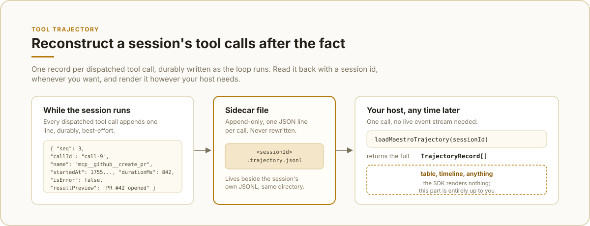

# maestro-agent-sdk

[](https://github.com/maestrojeong/maestro-agent-sdk/actions/workflows/ci.yml)
[](https://www.npmjs.com/package/maestro-agent-sdk)
[](./LICENSE)

**The lightweight harness engine for agent products.**

Import the agent loop into your product, then assemble only what you need:
built-in or custom tools, sessions, memory compaction, MCP, and guardrails.
Your host keeps control of the UI, workflow, storage policy, auth, and
deployment.


Maestro is an ESM library, not a CLI wrapper, sidecar, gateway, or bundled app.
The current npm tarball is about 315 kB (1.2 MB unpacked), excluding
dependencies.

## Why Maestro?

- **A harness engine, not a product:** `maestroProvider()` gets you a
  batteries-included loop, or build from `AIAgent`, providers, tools, and
  hooks directly.
- **Lightweight:** one imported library and direct provider API calls, no
  agent CLI subprocess to install or supervise.
- **Host-controlled:** keep ownership of presentation, persistence, tenancy,
  approvals, and tool policy.
- **Ready for real workflows:** streaming events, resumable sessions, context
  compaction, and MCP tools are included.

## Positioning


Maestro sits at the library layer. CLI-wrapper SDKs keep another product's
harness underneath your application, and standalone agent products make you
adopt their whole operating model. Maestro gives your host the loop and
runtime primitives as a direct library call, leaving the product boundary
with you.

## Install

```bash
npm install maestro-agent-sdk
# or
bun add maestro-agent-sdk
```

The package is ESM-only and requires Node.js 20 or newer.

## Quick start

`maestroProvider()` is the batteries-included entry point. It creates the
provider, built-in tools, session store, memory handling, and event stream.

```ts
import { maestroProvider } from "maestro-agent-sdk";

for await (const event of maestroProvider({
  agent: "maestro",
  cwd: process.cwd(),
  model: "deepseek-v4-flash",
  systemPrompt: "You are a concise coding assistant.",
  prompt: "Inspect this project and summarize its package scripts.",
  effort: "medium",
  maxIterations: 20,
})) {
  if (event.type === "text_delta") process.stdout.write(event.content);
  if (event.type === "tool_use") console.error(`\n[tool] ${event.name}`);
}
```

Set the provider key before running the program:

```bash
DEEPSEEK_API_KEY=... node app.js
```

The async generator emits normalized events such as `text_delta`, `tool_use`,
`tool_result`, `session`, `result`, and `error`. A host can render, log, or
persist only the events it needs.

Pass a stable `sessionId` to resume a conversation. Sessions are stored as
JSONL files under `~/.maestro/sessions` by default.

For system-level instructions that may change between calls, pass
`ephemeralSystemPrompt`. Before each primary model call, Maestro appends it to
the invocation's starting user message on the provider wire, keeps that fixed
position across tool iterations, and excludes it from compaction and persisted
session history. The stable `systemPrompt` remains eligible for provider
prefix caching, and each tool-loop request stays a stable extension of the
previous one. The next external call must recompute from the transient
instruction's former position once.

The value is a user-role runtime hint, not a provider-native system-role policy
boundary. Pass only host-trusted content; keep security rules in the stable
system prompt and enforce them with tool or LLM hooks.

```ts
for await (const event of maestroProvider({
  agent: "maestro",
  cwd: process.cwd(),
  systemPrompt: stableBasePrompt,
  ephemeralSystemPrompt: currentRuntimeInstructions,
  prompt: userMessage,
})) {
  if (event.type === "text_delta") process.stdout.write(event.content);
}
```

## Providers and models

| Provider | Models | Credential |
| --- | --- | --- |
| DeepSeek V4 | `deepseek-v4-pro`, `deepseek-v4-flash` | `DEEPSEEK_API_KEY` |
| Moonshot Kimi | `kimi-k3`, `kimi-k2.7-code` | `MOONSHOT_API_KEY` |
| Zhipu GLM | `glm-5.3`, `glm-5.2`, `glm-5.3-flash` | `GLM_API_KEY` |

The model can be selected per call with `model`. Kimi uses
`https://api.moonshot.ai/v1` by default; set `MOONSHOT_BASE_URL` for the China
endpoint or a compatible proxy. GLM uses `https://open.bigmodel.cn/api/paas/v4`
by default; set `GLM_BASE_URL` for a regional/proxy override. Every GLM 5.x
model always thinks (thinking cannot be disabled) with three tiers —
low/high/max — that the five maestro `effort` levels collapse onto.

For direct provider access, use `fromEnv()` and compose your own agent:

```ts
import {
  AIAgent,
  DeepseekProvider,
  ToolRegistry,
  bashTool,
  runConversation,
} from "maestro-agent-sdk";

const tools = new ToolRegistry();
tools.register(bashTool);

const agent = new AIAgent(DeepseekProvider.fromEnv(), tools, {
  model: "deepseek-v4-flash",
  systemPrompt: "You are a concise assistant.",
  maxIterations: 10,
  effort: "medium",
});

const messages = [{
  role: "user" as const,
  content: "Explain this project in one paragraph.",
}];

for await (const event of runConversation(agent, messages)) {
  if (event.type === "text_delta") process.stdout.write(event.content);
}
```

`runConversation()` accepts the full `ProviderMessage[]` history. The array is
updated during the turn, so a custom host can persist it however it prefers.

## Capabilities

- Provider-driven tool-calling loop with abort support and configurable
  `maxIterations`, `maxTokens`, and reasoning `effort`.
- Built-in `Bash`, `Read`, `Write`, `Edit`, `Glob`, `Grep`, and `WebFetch`
  tools.
- Custom tools through `defineTool()` and `ToolRegistry`. Multi-step task
  tracking is intentionally left to the host (e.g. an MCP `task` server) rather
  than shipped as a built-in — see [No built-in task
  tools](#no-built-in-task-tools) below.
- Automatic context compaction and oversized tool-result truncation.
- Session persistence and multi-turn resume.
- MCP stdio and SSE client support through a host-provided resolver.
- Unified streaming events instead of a UI or CLI imposed by the SDK.

`Glob` and `Grep` use `rg` (ripgrep). Install it when those tools are needed.
Tool primitives are also available from the `maestro-agent-sdk/tools` subpath.

### Request composition



The `system` prompt is identical on every call. The first user message of an
invocation (its "anchor") carries the prompt, the per-turn `<system-reminder>`
(iteration budget only, frozen into saved history every turn), and, when
`enableToolSearch` is on, an ephemeral `<system-instructions>` block with the
deferred-tool catalog note. That note never touches saved history, is
recomputed once per invocation, and only ever rides the anchor message, so
later turns in the same run carry a fresh reminder but no ephemeral note.
`tools[]` reflects whichever deferred tools `ToolSearch` has activated so far,
and is forced to `[]` in the wrap-up zone (the final turns before
`maxIterations`) so the model finalizes from what it already has instead of
attempting another call.

### Tool trajectory



Every dispatched tool call appends one record to
`<sessionId>.trajectory.jsonl`, alongside the session's own JSONL: the call
id (the same one `tool_use`/`tool_result` UnifiedEvents carry), name,
`startedAt`/`durationMs`, error state, and a truncated result preview.
Call `loadMaestroTrajectory(sessionId)` any time after the fact to get the
full `TrajectoryRecord[]` back, without needing to have captured the live
event stream yourself. This is the same shape of data a tool like
[deepseek-harness](https://github.com/deepseek-ai/deepseek-harness)'s
Trajectory view renders as a timeline; this SDK stops at returning the
records; a table, a Gantt-style timeline, or nothing at all is entirely up
to your host.

```ts
import { loadMaestroTrajectory } from "maestro-agent-sdk";

const records = loadMaestroTrajectory(sessionId);
for (const r of records) {
  console.log(`${r.name} (${r.durationMs}ms): ${r.resultPreview}`);
}
```

### Custom tools

```ts
import {
  AIAgent,
  DeepseekProvider,
  defineTool,
  ToolRegistry,
  runConversation,
  type ToolHandler,
} from "maestro-agent-sdk";

const weatherTool: ToolHandler = {
  schema: defineTool({
    name: "get_weather",
    description: "Return a short weather summary for a city.",
    input_schema: {
      type: "object",
      properties: { city: { type: "string" } },
      required: ["city"],
    },
  }),
  async execute(input) {
    return `Weather in ${String(input.city)}: replace with your API call.`;
  },
};

const tools = new ToolRegistry();
tools.register(weatherTool);
const agent = new AIAgent(DeepseekProvider.fromEnv(), tools, {
  model: "deepseek-v4-flash",
  systemPrompt: "Use tools when they help.",
});

for await (const event of runConversation(agent, [
  { role: "user", content: "What's the weather in Seoul?" },
])) {
  if (event.type === "text_delta") process.stdout.write(event.content);
}
```

### No built-in task tools

Earlier versions shipped `TaskCreate`/`TaskUpdate`/`TaskList`/`TaskGet`/
`TaskOutput`/`TaskStop` as always-loaded built-ins, backed by a per-session
`TaskStore` and rendered into the `<system-reminder>` on every turn. As of
this version they're removed:

- **Not free even when unused.** The reminder queried the store every turn
  regardless of whether any consumer read it, and the schemas rode the wire
  on every call — cost paid by every host, whether or not it wanted the
  feature.
- **State that doesn't survive a session doesn't earn its keep.** Multi-agent
  hosts (a topic that can switch between Maestro/Claude/Codex, or that runs
  several agents against the same unit of work) need task state that outlives
  any single provider's session — an in-process store scoped to one
  `sessionId` can't do that.
- **The task-management surface is a host concern**, not an SDK concern —
  same reasoning as sessions, storage policy, and tool approvals staying with
  the host per this SDK's design.

If your host needs task tracking, register it as a normal tool (via
`ToolRegistry`/`defineTool`) or, for state shared across agents/sessions,
expose it as an MCP server and pass it through `AgentQueryOptions`' MCP
resolver like any other MCP tool.

### No built-in subagent tool

Earlier versions shipped an always-loaded `Agent` tool that spawned a
depth-capped, single-provider sub-agent. As of this version it's removed,
for the same reason as the built-in task tools: it was dead weight for
every host that already runs its own delegation surface (a multi-agent
host needs delegation that survives a topic switching providers, which a
built-in scoped to one provider's session can't offer), and a fixed cost
for hosts that never called it.

`AIAgent` and `ToolRegistry` are unaffected; a host that wants sub-agent
delegation can still build it directly by constructing a second `AIAgent`
with its own registry and forwarding a filtered set of tools via
`ToolRegistry.allHandlers()`, the same building block the removed tool used
internally.

## Configuration

The SDK reads environment variables at module load. It does not load `.env`
files; load `dotenv` or another env loader before importing the SDK if needed.
See [`.env.example`](./.env.example) for the complete template.

| Variable | Default | Use |
| --- | --- | --- |
| `DEEPSEEK_API_KEY` | none | DeepSeek credentials |
| `MOONSHOT_API_KEY` | none | Kimi credentials |
| `MOONSHOT_BASE_URL` | `https://api.moonshot.ai/v1` | Kimi endpoint or proxy |
| `GLM_API_KEY` | none | GLM (Zhipu AI) credentials |
| `GLM_BASE_URL` | `https://open.bigmodel.cn/api/paas/v4` | GLM endpoint or proxy |
| `GEMINI_API_KEY` | none | Optional image-QA fallback for non-vision models |
| `GEMINI_IMAGE_QA_MODEL` | `gemini-2.5-flash` | Model for the `View` tool |
| `MAESTRO_DATA_DIR` | `~/.maestro` | Session storage root |
| `MAESTRO_CONTEXT_WINDOW` | provider value | Compaction tuning/testing |
| `MAESTRO_MCP_POOL_IDLE_TTL_MS` | `300000` | MCP idle eviction time |
| `MAESTRO_MCP_POOL_MAX` | `16` | Maximum cached MCP clients |
| `MAESTRO_SDK_SILENT_BOOTSTRAP` | none | Set to `1` to silence bootstrap output |

`MAESTRO_DATA_DIR` must be set before the first SDK import. The memory
compressor uses the active model by default; no separate model is required.

### Image input

Kimi models and GLM's `glm-5.3-flash` have native vision. For DeepSeek and
GLM's `glm-5.2`/`glm-5.3` (which cannot see images natively), setting
`GEMINI_API_KEY` registers a `View` tool backed by the configured Gemini Flash
model. Supported images are PNG, JPG, WebP, and GIF up to 10 MB.

## MCP

Register an MCP resolver once in the host. Servers start lazily for a query and
support stdio, SSE, or Streamable HTTP transport.

```ts
import { setMcpResolver } from "maestro-agent-sdk";

setMcpResolver((opts) => ({
  playwright: { command: "playwright-mcp", args: [] },
  search: { type: "sse", url: "https://internal.example.com/mcp" },
  remote: {
    type: "http",
    url: "https://remote.example.com/mcp",
    headers: { Authorization: "Bearer <token>" },
  },
}));
```

Pass `enableToolSearch: true` to keep MCP schemas deferred until the model
selects the tools it needs. Without it, configured MCP tools are exposed
directly. The SDK caches clients by host/session scope and closes them during
shutdown.

## Guardrails and tool hooks

Use `disallowedTools` for a whole-call denylist and `toolHooks` for runtime
policy such as path allowlists, command inspection, auditing, or redaction.

```ts
for await (const event of maestroProvider({
  agent: "maestro",
  cwd: "/workspace",
  systemPrompt: "You are a coding agent.",
  prompt: "Review the project.",
  disallowedTools: ["Bash"],
  toolHooks: [{
    name: "workspace-only",
    pre: ({ toolName, input }) => {
      if (!["Write", "Edit"].includes(toolName)) return { decision: "allow" };
      return String(input.file_path ?? "").startsWith("/workspace/")
        ? { decision: "allow" }
        : { decision: "block", error: "path is outside /workspace" };
    },
  }],
})) {
  if (event.type === "text_delta") process.stdout.write(event.content);
}
```

For model-level policy, `llmPreHook` runs before each provider request and
`llmPostHook` runs after a completed assistant turn. Both return one of:

- `allow` — continue normally.
- `reject_content` — replace the content and continue.
- `tripwire` — abort the run.

Tool pre-hooks additionally support `modify` and `block`. Hooks receive the
actual tool input, so they can enforce host-specific filesystem and access
rules without changing the built-in tools.

For large outputs, opt into bounded context with `toolResultTruncation`:

```ts
toolResultTruncation: {
  enabled: true,
  maxBytes: 64 * 1024,
  saveFullOutput: true,
}
```

When full output is saved, the event metadata contains an opaque `outputRef`.

## Host integration

The host owns application-specific concerns. Use the dependency-injection
points below when integrating with an existing service:

```ts
import {
  setConversationReader,
  setLogger,
  setMcpResolver,
} from "maestro-agent-sdk";

setLogger(myLogger);
setMcpResolver((opts) => getMcpServersFor(opts));
setConversationReader((userId, topic, groupId) =>
  myStore.read({ userId, topic, groupId }),
);
```

The SDK does not chdir for `cwd`; it is a session and metadata hint. Built-in
file tools still receive the paths supplied in their tool calls. Use an
`AbortController` in `abortController` to cancel a running query.

## Development

```bash
git clone git@github.com:maestrojeong/maestro-agent-sdk.git
cd maestro-agent-sdk
bun install                 # npm install also works
npm run typecheck
npm run build
npm run lint
npm test                    # Glob/Grep tests require ripgrep
```

Runnable examples are in [`examples/`](./examples), including a DeepSeek loop
and a custom-tool walkthrough.

## License

[MIT](./LICENSE)
