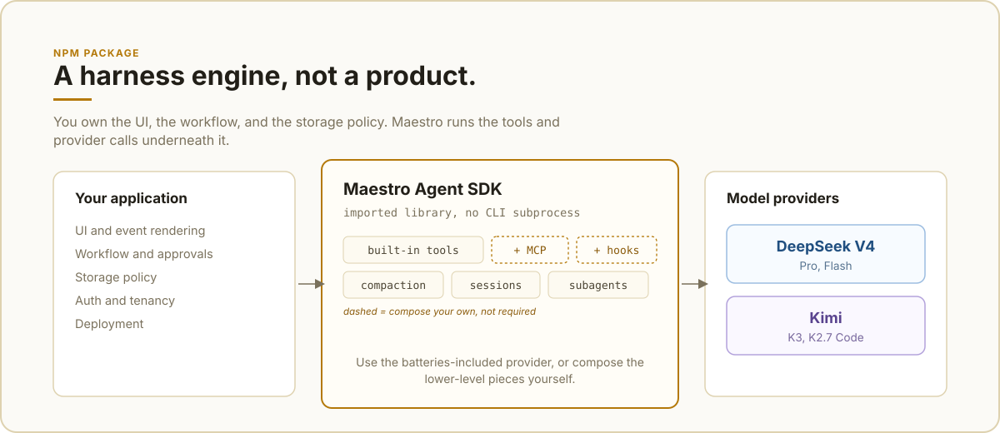
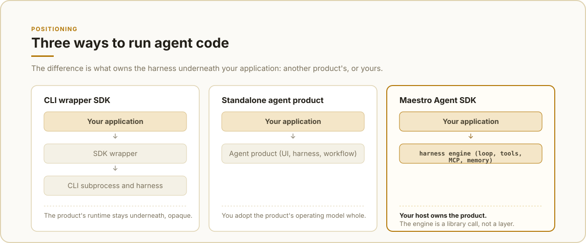

# maestro-agent-sdk

[](https://github.com/maestrojeong/maestro-agent-sdk/actions/workflows/ci.yml)
[](https://www.npmjs.com/package/maestro-agent-sdk)
[](./LICENSE)

**A lightweight, composable TypeScript agent SDK.**

Import the agent loop into your product, then assemble only what you need:
built-in or custom tools, sessions, memory compaction, MCP, guardrails, and
subagents. Your host keeps control of the UI, workflow, storage policy, auth,
and deployment.



Maestro is an ESM library, not a CLI wrapper, sidecar, gateway, or bundled app.
The current npm tarball is about 311 kB (1.16 MB unpacked), excluding
dependencies.

## Why Maestro?

- **Composable:** start with `maestroProvider()` or build from `AIAgent`,
  providers, tools, and hooks.
- **Lightweight:** one imported library and direct provider API calls—no agent
  CLI subprocess to install or supervise.
- **Host-controlled:** keep ownership of presentation, persistence, tenancy,
  approvals, and tool policy.
- **Ready for real workflows:** streaming events, resumable sessions, context
  compaction, MCP tools, and subagent delegation are included.

## Positioning



Maestro sits at the library layer. CLI-wrapper SDKs keep another product's
harness underneath your application; standalone agents bring their own
operating model. Maestro gives your host the loop and runtime primitives while
leaving the product boundary with you.

## Install

```bash
npm install maestro-agent-sdk
# or
bun add maestro-agent-sdk
```

The package is ESM-only and requires Node.js 20 or newer.

## Quick start

`maestroProvider()` is the batteries-included entry point. It creates the
provider, built-in tools, session store, memory handling, and event stream.

```ts
import { maestroProvider } from "maestro-agent-sdk";

for await (const event of maestroProvider({
  agent: "maestro",
  cwd: process.cwd(),
  model: "deepseek-v4-flash",
  systemPrompt: "You are a concise coding assistant.",
  prompt: "Inspect this project and summarize its package scripts.",
  effort: "medium",
  maxIterations: 20,
})) {
  if (event.type === "text_delta") process.stdout.write(event.content);
  if (event.type === "tool_use") console.error(`\n[tool] ${event.name}`);
}
```

Set the provider key before running the program:

```bash
DEEPSEEK_API_KEY=... node app.js
```

The async generator emits normalized events such as `text_delta`, `tool_use`,
`tool_result`, `tasks`, `session`, `result`, and `error`. A host can render,
log, or persist only the events it needs.

Pass a stable `sessionId` to resume a conversation. Sessions are stored as
JSONL files under `~/.maestro/sessions` by default.

## Providers and models

| Provider | Models | Credential |
| --- | --- | --- |
| DeepSeek V4 | `deepseek-v4-pro`, `deepseek-v4-flash` | `DEEPSEEK_API_KEY` |
| Moonshot Kimi | `kimi-k3`, `kimi-k2.7-code` | `MOONSHOT_API_KEY` |

The model can be selected per call with `model`. Kimi uses
`https://api.moonshot.ai/v1` by default; set `MOONSHOT_BASE_URL` for the China
endpoint or a compatible proxy.

For direct provider access, use `fromEnv()` and compose your own agent:

```ts
import {
  AIAgent,
  DeepseekProvider,
  ToolRegistry,
  bashTool,
  runConversation,
} from "maestro-agent-sdk";

const tools = new ToolRegistry();
tools.register(bashTool);

const agent = new AIAgent(DeepseekProvider.fromEnv(), tools, {
  model: "deepseek-v4-flash",
  systemPrompt: "You are a concise assistant.",
  maxIterations: 10,
  effort: "medium",
});

const messages = [{
  role: "user" as const,
  content: "Explain this project in one paragraph.",
}];

for await (const event of runConversation(agent, messages)) {
  if (event.type === "text_delta") process.stdout.write(event.content);
}
```

`runConversation()` accepts the full `ProviderMessage[]` history. The array is
updated during the turn, so a custom host can persist it however it prefers.

## Capabilities

- Provider-driven tool-calling loop with abort support and configurable
  `maxIterations`, `maxTokens`, and reasoning `effort`.
- Built-in `Bash`, `Read`, `Write`, `Edit`, `Glob`, `Grep`, `WebFetch`, and
  `Agent` tools, plus `TaskCreate`, `TaskUpdate`, `TaskList`, `TaskGet`,
  `TaskOutput`, and `TaskStop` for multi-step work.
- Custom tools through `defineTool()` and `ToolRegistry`.
- Automatic context compaction and oversized tool-result truncation.
- Session persistence and multi-turn resume, with task state kept per session.
- MCP stdio and SSE client support through a host-provided resolver.
- Unified streaming events instead of a UI or CLI imposed by the SDK.

`Glob` and `Grep` use `rg` (ripgrep). Install it when those tools are needed.
Tool primitives are also available from the `maestro-agent-sdk/tools` subpath.

### Custom tools

```ts
import {
  AIAgent,
  DeepseekProvider,
  defineTool,
  ToolRegistry,
  runConversation,
  type ToolHandler,
} from "maestro-agent-sdk";

const weatherTool: ToolHandler = {
  schema: defineTool({
    name: "get_weather",
    description: "Return a short weather summary for a city.",
    input_schema: {
      type: "object",
      properties: { city: { type: "string" } },
      required: ["city"],
    },
  }),
  async execute(input) {
    return `Weather in ${String(input.city)}: replace with your API call.`;
  },
};

const tools = new ToolRegistry();
tools.register(weatherTool);
const agent = new AIAgent(DeepseekProvider.fromEnv(), tools, {
  model: "deepseek-v4-flash",
  systemPrompt: "Use tools when they help.",
});

for await (const event of runConversation(agent, [
  { role: "user", content: "What's the weather in Seoul?" },
])) {
  if (event.type === "text_delta") process.stdout.write(event.content);
}
```

## Configuration

The SDK reads environment variables at module load. It does not load `.env`
files; load `dotenv` or another env loader before importing the SDK if needed.
See [`.env.example`](./.env.example) for the complete template.

| Variable | Default | Use |
| --- | --- | --- |
| `DEEPSEEK_API_KEY` | none | DeepSeek credentials |
| `MOONSHOT_API_KEY` | none | Kimi credentials |
| `MOONSHOT_BASE_URL` | `https://api.moonshot.ai/v1` | Kimi endpoint or proxy |
| `GEMINI_API_KEY` | none | Optional DeepSeek image-QA fallback |
| `GEMINI_IMAGE_QA_MODEL` | `gemini-2.5-flash` | Model for the `View` tool |
| `MAESTRO_DATA_DIR` | `~/.maestro` | Session and task storage root |
| `MAESTRO_CONTEXT_WINDOW` | provider value | Compaction tuning/testing |
| `MAESTRO_MCP_POOL_IDLE_TTL_MS` | `300000` | MCP idle eviction time |
| `MAESTRO_MCP_POOL_MAX` | `16` | Maximum cached MCP clients |
| `MAESTRO_SUBAGENT_MAX_TOKENS` | model-derived | Spawned-agent output limit |
| `MAESTRO_SDK_SILENT_BOOTSTRAP` | none | Set to `1` to silence bootstrap output |

`MAESTRO_DATA_DIR` must be set before the first SDK import. The memory
compressor uses the active model by default; no separate model is required.

### Image input

Kimi models have native vision. For DeepSeek, setting `GEMINI_API_KEY`
registers a `View` tool backed by the configured Gemini Flash model. Supported
images are PNG, JPG, WebP, and GIF up to 10 MB.

## MCP

Register an MCP resolver once in the host. Servers start lazily for a query and
support stdio or SSE transport.

```ts
import { setMcpResolver } from "maestro-agent-sdk";

setMcpResolver((opts) => ({
  playwright: { command: "playwright-mcp", args: [] },
  search: { type: "sse", url: "https://internal.example.com/mcp" },
}));
```

Pass `enableToolSearch: true` to keep MCP schemas deferred until the model
selects the tools it needs. Without it, configured MCP tools are exposed
directly. The SDK caches clients by host/session scope and closes them during
shutdown.

## Guardrails and tool hooks

Use `disallowedTools` for a whole-call denylist and `toolHooks` for runtime
policy such as path allowlists, command inspection, auditing, or redaction.

```ts
for await (const event of maestroProvider({
  agent: "maestro",
  cwd: "/workspace",
  systemPrompt: "You are a coding agent.",
  prompt: "Review the project.",
  disallowedTools: ["Bash"],
  toolHooks: [{
    name: "workspace-only",
    pre: ({ toolName, input }) => {
      if (!["Write", "Edit"].includes(toolName)) return { decision: "allow" };
      return String(input.file_path ?? "").startsWith("/workspace/")
        ? { decision: "allow" }
        : { decision: "block", error: "path is outside /workspace" };
    },
  }],
})) {
  if (event.type === "text_delta") process.stdout.write(event.content);
}
```

For model-level policy, `llmPreHook` runs before each provider request and
`llmPostHook` runs after a completed assistant turn. Both return one of:

- `allow` — continue normally.
- `reject_content` — replace the content and continue.
- `tripwire` — abort the run.

Tool pre-hooks additionally support `modify` and `block`. Hooks receive the
actual tool input, so they can enforce host-specific filesystem and access
rules without changing the built-in tools.

For large outputs, opt into bounded context with `toolResultTruncation`:

```ts
toolResultTruncation: {
  enabled: true,
  maxBytes: 64 * 1024,
  saveFullOutput: true,
}
```

When full output is saved, the event metadata contains an opaque `outputRef`.

## Host integration

The host owns application-specific concerns. Use the dependency-injection
points below when integrating with an existing service:

```ts
import {
  setConversationReader,
  setLogger,
  setMcpResolver,
} from "maestro-agent-sdk";

setLogger(myLogger);
setMcpResolver((opts) => getMcpServersFor(opts));
setConversationReader((userId, topic, groupId) =>
  myStore.read({ userId, topic, groupId }),
);
```

The SDK does not chdir for `cwd`; it is a session and metadata hint. Built-in
file tools still receive the paths supplied in their tool calls. Use an
`AbortController` in `abortController` to cancel a running query.

## Development

```bash
git clone git@github.com:maestrojeong/maestro-agent-sdk.git
cd maestro-agent-sdk
bun install                 # npm install also works
npm run typecheck
npm run build
npm run lint
npm test                    # Glob/Grep tests require ripgrep
```

Runnable examples are in [`examples/`](./examples), including a DeepSeek loop
and a custom-tool walkthrough.

## License

[MIT](./LICENSE)
