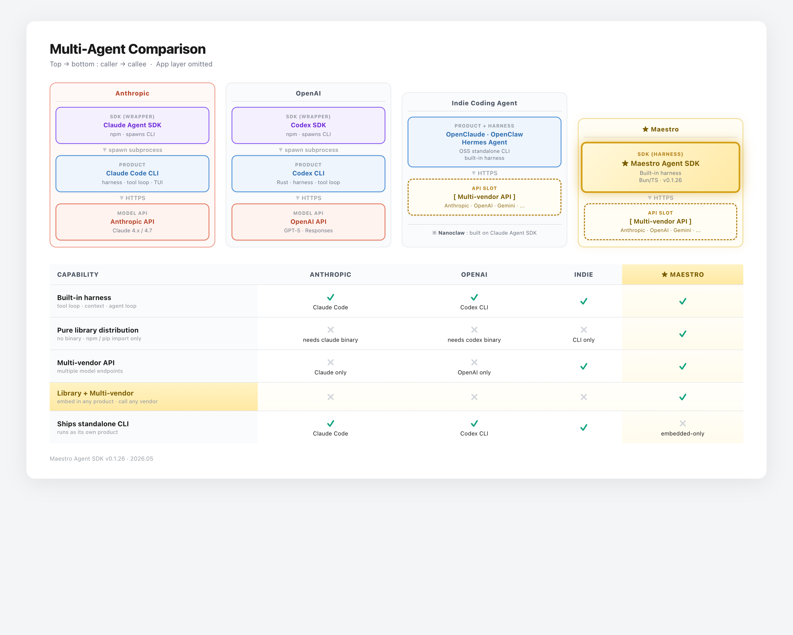

# maestro-agent-sdk

[](https://github.com/maestrojeong/maestro-agent-sdk/actions/workflows/ci.yml)
[](https://www.npmjs.com/package/maestro-agent-sdk)
[](./LICENSE)

**Embeddable agent SDK — memory, MCP, and host-controlled guardrails out of the box.**
DeepSeek V4 and Kimi K3/K2.7 Code provider support. No CLI, no gateway, no host lock-in.



> A pure-library agent runtime — the harness ships inside the SDK, so you `import` it into any host instead of shelling out to a CLI. ([details](#positioning--a-building-block-not-a-product))

> **Status:** Early port (v0.1.x). Active development. API surface may change before 1.0.

A provider-backed agent runtime. Inject your own logger/MCP resolver/hooks, and embed it in any host process — no framework, no lock-in.

## What's in the box

- **Agent loop** — provider-driven tool-calling loop with iteration cap, abort signal, LLM pre/post guardrail hooks, and event stream.
- **DeepSeek provider** — first-class adapter for DeepSeek V4 with a provider-neutral message schema under the loop.
- **Kimi provider** — K3 and K2.7 Code support with preserved thinking, native vision, streaming, and tool calls.
- **Built-in tools** — `Bash` (+ `BashOutput`/`KillBash` for background processes), `Read`, `Write`, `Edit`, `Glob`, `Grep`, `Agent` (sub-agent delegation), `TaskCreate`/`TaskUpdate`/`TaskList`/`TaskGet`/`TaskOutput`/`TaskStop`, `WebFetch` (optional SSRF policy via `createWebFetchTool`), `AskUserQuestion`, `ToolSearch` (deferred-tool activation), `View` (Gemini image QA — DeepSeek only, see [Image handling](#image-handling-deepseek)). Bring your own via `ToolRegistry`. Grep shells out to ripgrep (`rg`) so install it if you want the tool active; the SDK surfaces a structured error pointing to the install path when missing. Tool primitives are also importable from the `maestro-agent-sdk/tools` subpath when you don't need the rest of the runtime.
- **MCP** — built-in client pool (stdio + SSE) so any MCP server (`@modelcontextprotocol/sdk`) shows up as tools.
- **Memory** — automatic context compression (summarization + pruning) when the token budget is hit. Reuses the agent's own model for compaction — no separate model knob.
- **Session persistence** — multi-turn resume via `~/.maestro/sessions/<sessionId>.jsonl`, with a `_meta` header capturing `cwd`, `userId`, and host metadata for forensics.
- **Host integration via DI** — `setLogger`, `setMcpResolver`, `setConversationReader` let you embed without inheriting any one host's opinions. FS policy (path allowlists, owner checks) is a host concern — register a `PreToolUseHook` via `ToolRegistry.use()`.

## Install

```bash
npm install maestro-agent-sdk
# or
bun add maestro-agent-sdk
```

Requires Node.js 20+.

## Quick start

### DeepSeek (V4)

The unified event stream, tool registry, and `runConversation()` driver are
shared across direct `AIAgent` usage and the batteries-included
`maestroProvider()` entry point.

```ts
import {
  AIAgent,
  DeepseekProvider,
  bashTool,
  ToolRegistry,
  runConversation,
} from "maestro-agent-sdk";

const provider = DeepseekProvider.fromEnv();

const tools = new ToolRegistry();
tools.register(bashTool);

const agent = new AIAgent(provider, tools, {
  model: "deepseek-v4-flash",      // or "deepseek-v4-pro"
  systemPrompt: "You are a concise assistant.",
  maxIterations: 20,
  maxTokens: 2048,
  effort: "medium",                 // DeepSeek maps this to `reasoning_effort`
});

// `runConversation` takes the full message history, not a bare string —
// the caller owns this array and it mutates in place as the turn runs, so
// you can persist it (or the next prompt's array) for multi-turn resume.
const messages = [{ role: "user" as const, content: "Summarize today's news." }];

for await (const event of runConversation(agent, messages)) {
  if (event.type === "text_delta") process.stdout.write(event.content);
  if (event.type === "tool_use") console.error(`\n[tool] ${event.name}`);
}
```

### Kimi

Set `MOONSHOT_API_KEY`, then select `kimi`/`kimi-pro` for K3 or `kimi-code`
for K2.7 Code through `maestroProvider()`. Direct provider usage is also
available from the root package or `maestro-agent-sdk/providers/kimi`:

```ts
import { KimiProvider } from "maestro-agent-sdk";

const provider = KimiProvider.fromEnv();
```

The default endpoint is `https://api.moonshot.ai/v1`. Set
`MOONSHOT_BASE_URL=https://api.moonshot.cn/v1` for the China platform or to
route through a compatible proxy. Kimi vision accepts base64 and `ms://` file
references; public image URLs are rejected before the request is sent.

## Image handling (DeepSeek)

DeepSeek models cannot inspect image pixels directly. When `GEMINI_API_KEY` is
set and the active model starts with `deepseek-`, the SDK automatically registers
a `View` tool backed by `gemini-2.5-flash`:

```ts
// No extra setup needed — GEMINI_API_KEY in env is enough.
// The View tool is registered automatically for deepseek-* models.
const provider = DeepseekProvider.fromEnv();
// Set GEMINI_API_KEY= in your environment.
```

The model calls `View({ image_path: "/abs/path/to/file.png", question: "..." })`
and receives a plain-text answer from Gemini. Supported formats: PNG, JPG, WebP,
GIF (≤ 10 MB).

You can also register the tool manually:

```ts
import { createGeminiImageQATool } from "maestro-agent-sdk";

tools.register(createGeminiImageQATool({ apiKey: process.env.GEMINI_API_KEY }));
```

> **Effort scale.** `effort` is the *reasoning-depth* knob — it is **decoupled
> from the iteration cap** (split in v0.1.16). The tool-iteration cap comes only
> from `maxIterations`, which defaults to **unbounded** (`Number.POSITIVE_INFINITY`)
> since v0.1.26; the loop runs until the model emits `end_turn` or the host
> aborts. The model still sees its remaining-iteration count in a
> `<system-reminder>` block every turn so it can self-pace. What `effort` drives:
>
> | effort   | persona (`## Working mode`) | DeepSeek `reasoning_effort` |
> |----------|-----------------------------|-----------------------------|
> | `low`    | answer fast — one file, no cross-check  | `low`    |
> | `medium` | focused work — one area, in-file check  | `medium` |
> | `high`   | careful work — multi-file + verify      | `high`   |
> | `xhigh`  | thorough — survey then drill down       | `high`   |
> | `max`    | exhaustive — all files, all edge cases  | `max`    |
>
> `effort` resolves to `medium` when omitted. `xhigh` intentionally maps to
> DeepSeek `high`; `max` is reserved for the deepest DeepSeek reasoning tier.
> `effort` also propagates to spawned sub-agents as `parentEffort`.

More runnable scripts live under [`examples/`](./examples) — DeepSeek and a
custom-tool walkthrough.

## Configuration

Per-call options on `AgentQueryOptions`:

| Option | Required | Purpose |
|---|---|---|
| `cwd` | ✓ | Session working-directory hint. `mkdir -p`'d so resume flows can stat the path, and stamped into the rollout `_meta` header for forensics. Not auto-injected into tool calls — built-in tools still require absolute paths. |
| `sessionMetadata` | — | Opaque host bag round-tripped via the rollout `_meta` header. |

The SDK resolves its data directory at module load. Override via env var
**before** importing any SDK module (the value is captured once):

| Env var | Default | What it does |
|---|---|---|
| `MAESTRO_DATA_DIR` | `~/.maestro` | Where session JSONLs and todo stores live. `maestroSessionsDir()` resolves to `<DATA_DIR>/sessions`. |
| `MOONSHOT_API_KEY` | — | Enables Kimi K3 and K2.7 Code requests. |
| `MOONSHOT_BASE_URL` | `https://api.moonshot.ai/v1` | Overrides the Kimi API base URL for regional endpoints or proxies. |
| `GEMINI_API_KEY` | — | Enables the `View` image-QA tool when using a DeepSeek model. See [Image handling](#image-handling-deepseek). |

Everything else is per-call: pass `cwd`, `model`, `effort`, etc. through
`AIAgentConfig` / `AgentQueryOptions`. The memory compressor reuses the
agent's configured `model` — no separate compression-model knob.

For session housekeeping there's a helper hosts can wire into their
startup sweep:

```ts
import { cleanupStaleMaestroSessions, DEFAULT_MAESTRO_SESSION_TTL_MS } from "maestro-agent-sdk";

// At boot: drop JSONLs untouched for >30 days (default).
const { scanned, removed } = cleanupStaleMaestroSessions();
console.log(`maestro sweep: removed ${removed}/${scanned}`);
```

## Tasks — granular CRUD via Claude-Code-style `Task*` family

v0.1.5 replaced the v0.1.x `TodoWrite` snapshot-replace tool with the
`Task*` family — `TaskCreate`, `TaskUpdate`, `TaskList`, `TaskGet`. The
trade-off: per-call payloads are smaller (one task at a time vs the whole
list every turn) and the model gets first-class dependency edges and
per-task metadata.

```ts
// Bootstrap a multi-step plan.
TaskCreate({ subject: "Read spec", activeForm: "Reading spec" });
// → { ok: true, id: "1", subject: "Read spec" }

TaskCreate({ subject: "Implement loader" });
// → { ok: true, id: "2" }

TaskCreate({ subject: "Write tests", owner: "general" });
// → { ok: true, id: "3" }

// Wire dependencies. Both sides update in sync.
TaskUpdate({ taskId: "3", addBlockedBy: ["2"] });

// Advance status. Setting in_progress demotes any other in-flight task.
TaskUpdate({ taskId: "1", status: "in_progress" });
TaskUpdate({ taskId: "1", status: "completed" });
TaskUpdate({ taskId: "2", status: "in_progress" });
// → { ok: true, task: {...}, demotedId: "1" }  // (was already completed, no-op)

// Read side — the per-turn system reminder already renders a summary;
// TaskList exists for programmatic refresh after batch updates.
TaskList();
// TaskGet({ taskId: "2" }) for the full entry with description + metadata.
```

Persistence: `~/.maestro/sessions/<sessionId>.tasks.json` (`version: 2`).
Files written by SDK ≤ 0.1.4 land at `.todos.json` (`version: 1`); the
v0.1.5 store auto-migrates on first hydrate so existing sessions keep their
plan without manual conversion. The migration strips the `task-N` prefix
to bare numeric ids and maps `content` → `subject`.

The system reminder rendered every turn carries a compact view:

```
Tasks (1/3):
  [✓] #1  Read spec
  [→] #2  Implement loader
  [ ] #3  Write tests (blocked by #2)
```

## Session rollout format (since v0.1.5)

Each session JSONL at `~/.maestro/sessions/<sessionId>.jsonl` carries a
`_meta` header line for forensics and host-side indexing:

```jsonl
{"_meta":{"version":1,"cwd":"/path","userId":"...","createdAt":"2026-05-18T...","sdkVersion":"0.1.x","metadata":{...}}}
{"role":"user","content":"..."}
{"role":"assistant","content":[...]}
```

Backward-compatible: files written by SDK ≤ 0.1.4 had no header — the loader
treats their first line as a regular message. Hosts that want to inspect
session metadata without reading the full message log can call
`loadMaestroSessionMeta(sessionId)`.

## Manual compaction

Automatic compaction runs inside `maestroProvider(...)` when the context
budget is high. Hosts can also force a compaction pass between turns:

```ts
import {
  compactMaestroSession,
  providerForModel,
  resolveAuxModel,
} from "maestro-agent-sdk";

const model = "deepseek-v4-pro";
const result = await compactMaestroSession({
  sessionId,
  auxProvider: providerForModel(model),
  auxModel: resolveAuxModel(model),
  focusTopic: "auth refactor",
});

if (result.didCompact) {
  console.log("compacted", result.summary);
}
```

For custom storage, use `compactMessagesNow(messages, { auxProvider, auxModel })`
and persist `result.canonicalMessages` when `result.didCompact` is true.

## Positioning — a building block, not a product

maestro-agent-sdk is an agent *runtime*, not an agent *product*. You pick the UI, the guardrail rules, and the storage layer.

### Where it sits in the stack

Refer to the architecture chart at the top of this README. Top → bottom is caller → callee. Anthropic and OpenAI ship SDKs that spawn their own CLIs as subprocesses — you inherit the harness, but also inherit the binary and product shape. Indie coding agents (OpenClaude, OpenClaw, Hermes, Nanoclaw) keep the harness but ship as full products or CLI-first tools. **Maestro is a pure library runtime** — the harness lives inside the SDK, so you `import` it into any host process.

| Capability                                       | Anthropic         | OpenAI            | Indie         | Maestro         |
| ------------------------------------------------ | ----------------- | ----------------- | ------------- | --------------- |
| **Built-in harness** (tool loop · context · agent loop) | ✓ Claude Code     | ✓ Codex CLI       | ✓             | ✓               |
| **Pure library distribution** (npm/pip import only)     | ✗ needs `claude`  | ✗ needs `codex`   | ✗ CLI only    | ✓               |
| **Maintained provider surface**                         | Claude            | OpenAI            | varies        | DeepSeek V4, Kimi K3/K2.7 |
| **Library runtime** (embed anywhere)                    | ✗                 | ✗                 | ✗             | ✓               |
| **Ships standalone CLI** (runs as its own product)      | ✓ Claude Code     | ✓ Codex CLI       | ✓             | ✗ embedded-only |

The trade-off Maestro accepts: **no standalone CLI**. You don't get a `maestro` binary to drop on a server — you get an SDK to embed inside your own host.

### Adjacent projects

| Project | Layer | Key trade-off |
|---------|-------|---------------|
| **maestro-agent-sdk** | Embeddable SDK | Agent loop only — no CLI, no UI, no fixed product shape. Host injects logger, MCP resolver, session store, guardrails. |
| **hermes-agent** | Full-featured app | TUI, web dashboard, gateway, cron, Discord/Feishu. All-in-one — opinionated and coupled to its own host. |
| **OpenAI Agents SDK** | SDK + scaffold | Strong guardrails/tracing/handoffs, but multi-agent by design — heavier abstraction surface. |
| **oh-my-claudecode** | Orchestration plugin | Sits on Claude Code agent loop. Value is team mode, LSP tools, session replay. |

**maestro-agent-sdk leaves product decisions to you.** Same `AIAgent` works in a Telegram bot, cron runner, or code review pipeline.

## Host integration (DI)

```ts
import {
  setLogger,
  setMcpResolver,
  setConversationReader,
} from "maestro-agent-sdk";

// 1) Replace the console logger with your structured logger (pino, winston, ...).
setLogger(myPinoLogger);

// 2) Provide MCP server specs per-query.
setMcpResolver((opts) => ({
  "playwright": { command: "playwright-mcp", args: [] },
  "fs": { command: "mcp-fs", args: ["--root", opts.cwd] },
}));

// 3) Back-fill conversation history for cross-agent forks.
setConversationReader((userId, topic, groupId) => myStore.read({ userId, topic, groupId }));
```


## Hooks & Guardrails — LLM pre/post + tool hooks

### LLM Pre Hook — inspect every API call

Fires right before every provider call. The host can pass through, replace the user-visible content, or tripwire the entire run. Receives the full message array (system + history + current turn).

```ts
import { AIAgent, DeepseekProvider, ToolRegistry } from "maestro-agent-sdk";

const provider = DeepseekProvider.fromEnv();
const agent = new AIAgent(provider, tools, {
  model: "deepseek-v4-flash",
  systemPrompt: "...",
  llmPreHook: async (messages, { abortSignal }) => {
    const lastUser = messages.filter((m) => m.role === "user").at(-1);
    const text = typeof lastUser?.content === "string" ? lastUser.content : "";
    if (/api[_-]?key|password/i.test(text)) {
      return {
        decision: "reject_content",
        message: "Sensitive credential detected — please rephrase without secrets.",
      };
    }
    if (/rm -rf \//.test(text)) {
      return { decision: "tripwire", message: "Destructive request blocked." };
    }
    return { decision: "allow" };
  },
});
```

### LLM Post Hook — validate the final turn

Fires when the model produced a turn-complete response (no pending tool calls), before the `result` event is yielded. Use for output redaction, API-key leak detection, or final policy enforcement.

```ts
const agent = new AIAgent(provider, tools, {
  // ...
  llmPostHook: async (text, { messages }) => {
    if (/sk-[a-zA-Z0-9]{20,}/.test(text)) {
      return {
        decision: "reject_content",
        message: "[redacted: API key leak detected in assistant output]",
      };
    }
    return { decision: "allow" };
  },
});
```

### Disallowed tools — hide and hard-block

`maestroProvider({ disallowedTools })` is the Claude Code-compatible coarse
tool denylist. Matching is exact by tool name. Disallowed tools are omitted
from the provider `tools` schema and from the ToolSearch deferred catalog; if
a stale or hallucinated `tool_use` still arrives, dispatch returns an error
without running hooks or the tool handler.

```ts
for await (const event of maestroProvider({
  agent: "maestro",
  cwd: "/workspace",
  systemPrompt: "You are a coding agent.",
  prompt: "Work without asking follow-up questions.",
  disallowedTools: ["AskUserQuestion", "Bash"],
})) {
  // ...
}
```

Use `disallowedTools` when a tool should be unavailable for the whole call.
Use `toolHooks` for finer runtime policy, such as path allowlists or command
inspection.

### Tool hooks — per-tool pre/post

`ToolRegistry.use({ pre, post })` brackets every `dispatch()`. Pre can `allow` / `modify` / `block`; post sees the actual outcome via `status: "ok" | "blocked" | "error"` (since v0.1.14) so audit/telemetry hooks observe denied and failed calls too.

```ts
import { ToolRegistry, type PreToolUseDecision } from "maestro-agent-sdk";

const tools = new ToolRegistry();
// ... register builtin tools ...

tools.use({
  name: "fs-allowlist",
  pre: ({ toolName, input }): PreToolUseDecision => {
    if (toolName !== "Write" && toolName !== "Edit") return { decision: "allow" };
    const path = String(input.file_path ?? "");
    if (!path.startsWith("/workspace/")) {
      return { decision: "block", error: `path '${path}' outside allowlist` };
    }
    return { decision: "allow" };
  },
  post: ({ toolName, status, error, output }) => {
    metrics.increment(`tool.${toolName}.${status}`);
    if (status === "error") logger.warn({ toolName, error }, "tool failed");
    return {};  // pass output through unchanged
  },
});
```

### Guardrail decisions

| Decision | Effect |
|----------|--------|
| `allow` | Proceed normally |
| `reject_content` | Replace the message/result, continue execution |
| `tripwire` | Abort the entire agent run immediately (LLM hooks only) |
| `modify` | (Tool pre hooks only) Substitute the tool's `input` before dispatch |
| `block` | (Tool pre hooks only) Skip tool execution, return the supplied error |

## MCP — zero-config client pool

Wire an `McpResolver` and the SDK lazily spawns, caches, and reuses MCP subprocess clients across turns. Cache key includes `(userId, session, groupId, agentKind, server, specHash)` — two users never share a client, and same-server / same-spec calls within a session reuse the warm process.

```ts
import { setMcpResolver } from "maestro-agent-sdk";

setMcpResolver((opts) => ({
  playwright: {
    command: "playwright-mcp",
    args: ["--user-data-dir", `/tmp/pw-${opts.userId}`],
  },
  // SSE transport
  search: { type: "sse", url: "https://internal.example.com/mcp" },
}));
```

- **Lazy spawn** — servers start on first tool call, not at agent creation.
- **Pool cache** — `(userId, session, groupId, agentKind, server, specHash)` keyed; idle TTL 5 min, LRU cap 16 (override via `MAESTRO_MCP_POOL_IDLE_TTL_MS` / `MAESTRO_MCP_POOL_MAX`).
- **In-flight dedup** — concurrent acquires on the same key await one `start()` instead of double-spawning (v0.1.14).
- **Env values in cache hash** — `{ TOKEN: alice }` and `{ TOKEN: bob }` get separate processes by default; opt high-churn keys out via `setMcpCacheIgnoreEnvKeys(["DEPTH"])` (v0.1.14).
- **stdio + SSE** — both transports supported via `MaestroMcpServerSpec`.
- **Graceful shutdown** — `SIGINT` / `SIGTERM` closes every cached client before exit.

## Development

```bash
git clone git@github.com:maestrojeong/maestro-agent-sdk.git
cd maestro-agent-sdk
bun install         # also supported
npm install         # alternative
npm run typecheck   # tsc --noEmit
npm run build       # tsc + tsc-alias → dist/
npm test            # vitest, 481 tests (+11 skipped without ripgrep)
```

## License

[MIT](./LICENSE). 
